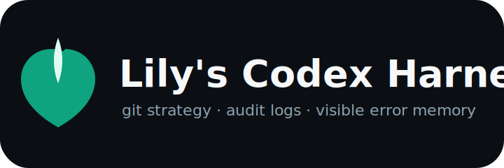

<div align="center">

**🌐 [English](README_EN.md) | 한국어**



# My Codex Harness

**Codex를 팀 단위 개발 루프처럼 굴리기 위한 설치형 하네스**

[](https://github.com/jh941213/my-codex-harness)
[](LICENSE)
[](#skills-36개)
[](#custom-agents-15개)
[](#항상-켜지는-hooks)

`Skills` · `Custom Agents` · `Hooks` · `Git Strategy` · `Docs Sync` · `Major Error Log`


</div>

---

## 한 줄 요약

이 저장소는 OpenAI Codex에 **36개 skills**, **15개 custom agents**, **15개 lifecycle hooks**, **작업 로그**, **커밋 로그**, **모델이 읽는 주요 에러 로그**, **Azure Infra memory**, **docs 자동 동기화 규칙**을 설치합니다.

결과적으로 Codex가 매 작업마다 다음 루프를 따르게 됩니다.

```text
계획 세우기 -> Git 전략 남기기 -> 구현 -> 로그 기록 -> 검증 -> docs/harness 갱신 -> 커밋 후보 기록
```

## 빠른 설치

macOS와 Homebrew 기준입니다.

```bash
git clone https://github.com/jh941213/my-codex-harness.git
cd my-codex-harness

# 코드 검색, 구조적 diff, 시크릿 스캔, 쉘 검증 도구 설치
brew bundle --file Brewfile.codex

# mgrep semantic search 연동
npm install -g @mixedbread/mgrep

# 선택: Tavily/Exa 검색 MCP 키는 환경변수나 ~/.mcp.json에 둡니다
export TAVILY_API_KEY="<your tavily key>"
export EXA_API_KEY="<your exa key>"

# 한국어 하네스 설치
bash install.sh --ko
```

설치 후 **Codex를 재시작**하세요. 처음 한 번은 Codex에서 `/hooks`를 열고 새 hook을 검토한 뒤 trust 해야 합니다.

```text
/hooks
```

`15 hooks need review before they can run`은 첫 설치 후 정상 동작입니다. trust가 끝나면 `/hooks` 화면에서 `Installed`와 `Active` 숫자가 같아집니다.

## 사전 요구사항

| 구분 | 설치 항목 | 확인 방법 |
|------|-----------|-----------|
| 필수 | Git | `git --version` |
| 필수 | Python 3.11+ 권장 | `python3 --version` |
| 필수 | OpenAI Codex CLI | `codex --version` |
| 권장 | Homebrew | `brew --version` |
| 권장 | GitHub CLI | `gh --version` |

통합 도구는 `Brewfile.codex`로 한 번에 설치합니다.

| 도구 | 용도 |
|------|------|
| `rg`, `fd` | 빠른 파일/텍스트 탐색 |
| `jq`, `yq` | JSON, YAML, TOML 주변 설정 확인 |
| `mgrep` | semantic local search와 Codex MCP 연동 |
| Tavily MCP | 최신 웹 검색과 페이지 추출 |
| Exa MCP | 고품질 웹/리서치 검색과 근거 수집 |
| `ast-grep` (`sg`) | AST 기반 코드 패턴 탐지 |
| `semgrep` (`sgrep` 호환 확인) | 보안/정적 분석 룰 기반 스캔 |
| `difftastic` (`difft`) | 포맷 노이즈를 줄인 구조적 diff |
| `gitleaks` | 시크릿 스캔 |
| `scc` | 코드 통계와 복잡도 분석 |
| `shellcheck`, `shfmt` | hook/install 스크립트 품질 검증 |
| `osv-scanner` | 의존성 취약점 확인 |
| `git-delta` | diff 가독성 개선 |
| `az` (`azure-cli`) | Azure 리소스 검토, 비용 산정, 운영 모니터링 |

도구가 없으면 해당 검사는 건너뛰도록 되어 있습니다. 다만 팀 공용 하네스로 쓰려면 `brew bundle --file Brewfile.codex`를 권장합니다.

`mgrep install-codex`는 semantic search를 위해 작업 디렉터리 파일을 Mixedbread 쪽으로 동기화할 수 있습니다. 민감한 저장소에서는 조직 정책을 확인한 뒤 켜세요.

Tavily/Exa MCP는 API 키를 repo에 저장하지 않습니다. installer는 `TAVILY_API_KEY`, `EXA_API_KEY` 환경변수를 먼저 보고, 없으면 기존 `~/.mcp.json`의 `tavily`/`exa` 항목에서 읽도록 Codex MCP 설정을 구성합니다.

## 설치되는 것

```text
~/.codex/
├── config.toml                         # features, skills, hooks, agents 관리 블록
├── skills/                             # 36개 Codex skills
├── agents/                             # 15개 custom agent TOML
├── hooks/                              # 15개 lifecycle hook 스크립트
├── rules/                              # Git/workflow 규칙
├── scripts/check-codex-integrations.sh # 설치 검증 스크립트
└── agent-instructions/my-codex-harness/
```

프로젝트별 런타임 로그는 작업 중인 저장소의 `.codex-harness/` 아래에 쌓입니다.

```text
.codex-harness/
├── git-strategy.md
├── logs/events.jsonl
├── commits/*.json
├── commits/*.md
├── docs-sync-queue.jsonl
└── model-visible/MAJOR_ERRORS.md
```

## 항상 켜지는 Hooks

이 항목들은 사용자가 `$skill`을 부르지 않아도 Codex lifecycle에서 동작합니다.

| Hook | 역할 |
|------|------|
| `codex-git-strategy-log.sh` | 매 작업 시작 시 브랜치, 커밋 분리, 검증, 롤백 전략 기록 |
| `codex-event-log.sh` | Session, prompt, tool, compact, stop 이벤트를 JSONL로 기록 |
| `codex-commit-log.sh` | `git commit` 후 커밋 메타데이터를 JSON/Markdown으로 저장 |
| `codex-major-error-log.sh` | 반복되거나 막히는 에러를 모델이 읽을 수 있는 `MAJOR_ERRORS.md`에 기록 |
| `codex-docs-sync-log.sh` | 변경 파일을 docs 동기화 큐에 남김 |
| `codex-visible-error-reminder.sh` | 세션/compact 이후 주요 에러 로그 확인을 유도 |
| `codex-git-guard.sh` | force push, protected branch 직접 push, `.env` 커밋 같은 위험 작업 차단 |
| `codex-prettier.sh` | 필요 시 포맷터 연동을 위한 hook 슬롯 |

## Codex 내장 기능 우선

Codex가 이미 잘하는 기능은 다시 만들지 않습니다.

| 먼저 쓸 것 | 언제 쓰나 | 하네스가 보강하는 것 |
|------------|-----------|----------------------|
| `/goal` | 긴 작업, 완료 조건, 중단/재개가 필요한 작업 | `docs/harness/TASKS.md`, `VALIDATION.md`에 진행 근거 유지 |
| `/plan` | 구현 전 계획과 리스크 분해 | 오래 남길 계획은 `$plan` 또는 실행 계획 문서로 승격 |
| `/review` | 현재 diff 빠른 리뷰 | 깊은 검토는 `$review`, `code_reviewer`, `security_reviewer` |
| `/diff` | 변경사항 확인 | `difft`, 커밋 후보 로그와 함께 사용 |
| `/compact` | 긴 세션 요약 | compact 전후 주요 에러와 작업 문서 확인 |
| `/agent` | sub-agent 상태 확인 | `.codex/agents/*.toml` 역할 지침 사용 |
| `/debug-config`, `/plugins`, `/mcp` | 설정/플러그인/MCP 진단 | 설치 스크립트와 검증 스크립트로 재현 가능하게 관리 |

## 검색 라우팅

| 검색 종류 | 우선 도구 |
|-----------|-----------|
| 로컬 파일 의미 검색 | `mgrep` |
| 정확한 코드/텍스트 검색 | `rg`, 필요 시 `sg` |
| 최신 웹 검색/페이지 추출 | Tavily MCP |
| 근거 수집형 웹/리서치 검색 | Exa MCP |
| 공식 OpenAI 문서 | `openaiDeveloperDocs` MCP |

`&goal` 같은 별도 alias는 설치하지 않습니다. Codex 내장 명령은 `/goal`, 하네스 skill은 `$verify`처럼 구분합니다.

## Skills 36개

| Skill | 쓰는 상황 |
|-------|-----------|
| `$prd` | 아이디어를 CPS, PRD, MARKET, USERS, FEATURES, RISKS, SPEC, APPENDIX로 정리 |
| `$plan`, `$spec`, `$spec-verify` | 계획, 명세, 구현 완료도 검증 |
| `$autodev`, `$autodev-parallel` | `/goal` 기반 단일/병렬 자율 개발 루프 |
| `$verify`, `$review`, `$simplify`, `$techdebt` | 검증, 리뷰, 단순화, 기술부채 정리 |
| `$commit-push-pr`, `$handoff`, `$compact-guide` | 커밋/푸시/PR, 인계, 컨텍스트 관리 |
| `$build-fix`, `$tdd`, `$e2e-verify`, `$e2e-agent-browser` | 빌드 복구, TDD, E2E 검증 |
| `$frontend`, `$ui-ux-pro-max`, `$react-patterns`, `$shadcn-ui`, `$tailwind-design-system` | UI, React, Tailwind, 디자인 시스템 |
| `$harness-diagnostics`, `$harness-audit`, `$eval` | 하네스 점검, 감사, 품질 평가 |
| 기술 스킬 | FastAPI, API 설계, async Python, pytest, TypeScript, Vercel React, Stitch, Nano Banana |

## Custom Agents 15개

| Agent | 역할 |
|-------|------|
| `planner` | 범위, 순서, 리스크, 검증 기준 분해 |
| `architect` | 모듈 경계, 의존성 방향, 마이그레이션 위험 검토 |
| `frontend_developer` | UI, React, 접근성, 반응형 구현 |
| `junior_mentor` | 초보 개발자가 이해할 수 있는 구현 설명과 학습 문서 |
| `langchain_specialist` | LangChain, LangGraph, Deep Agents 전략 |
| `prd_planner` | CPS, PRD, SPEC 기획 산출물 합성 |
| `code_reviewer` | 버그, 회귀, 테스트 누락, 구조적 diff 리뷰 |
| `security_reviewer` | 시크릿, 권한, 입력 검증, 의존성 보안 |
| `azure_infra` | Azure CLI 기반 리소스 산정, 비용/보안/운영 검토, 모니터링, Azure memory 기록 |
| `qa` | 사용자 시나리오와 검증 체크리스트 |
| `evaluator` | 독립 품질 점수화와 개선 루프 |
| `docs_writer` | 제품/기술 문서 작성 |
| `docs_maintainer` | `docs/harness/`를 실제 diff와 동기화 |
| `tdd_guide` | 테스트 우선 설계 |
| `stitch_developer` | Stitch 산출물의 React 변환 |

## 첫 실행 체크

설치 후 아래를 한 번 실행하세요.

```bash
~/.codex/scripts/check-codex-integrations.sh
```

현재 저장소에서 하네스 파일 자체를 검증하려면:

```bash
bash scripts/check-codex-integrations.sh
bash -n install.sh
for f in hooks/codex-*.sh scripts/check-codex-integrations.sh; do bash -n "$f"; done
```

Codex 안에서는 아래 순서로 확인하면 됩니다.

```text
/debug-config
/hooks
/status
```

## 문제 해결

| 증상 | 처리 |
|------|------|
| `15 hooks need review before they can run` | `/hooks`에서 hook을 검토하고 trust 하세요. 첫 설치 후 한 번만 필요합니다. |
| `[features].codex_hooks is deprecated` | 오래된 설정입니다. `bash install.sh --ko`를 다시 실행하면 `features.hooks = true`로 정리됩니다. |
| `Skipped loading skill ... invalid YAML` | 최신 저장소를 pull 한 뒤 `bash install.sh --ko`를 다시 실행하고 Codex를 재시작하세요. |
| integration tool missing | `brew bundle --file Brewfile.codex`를 실행하세요. 일부 검사는 도구가 없으면 자동 skip 됩니다. |
| `mgrep` missing | `npm install -g @mixedbread/mgrep` 후 필요하면 `mgrep login`, `mgrep install-codex`를 실행하세요. |
| Tavily/Exa key missing | `TAVILY_API_KEY`, `EXA_API_KEY`를 환경변수로 두거나 기존 `~/.mcp.json`에 저장하세요. |
| `az` not logged in | `az login` 후 `az account show`로 현재 subscription을 확인하세요. |
| hook이 Active가 아님 | Codex 재시작 후 `/hooks`에서 Installed와 Active 숫자를 확인하세요. |

## 작업 문서 규칙

모든 코딩 작업은 최종 응답 전에 `docs/harness/`를 실제 diff와 검증 결과에 맞춰 갱신하는 것을 기본 정책으로 둡니다.

| 문서 | 기록할 내용 |
|------|-------------|
| `TASKS.md` | 현재 작업 범위와 상태 |
| `CHANGELOG.md` | 구현 변경사항 |
| `DECISIONS.md` | 결정과 이유 |
| `VALIDATION.md` | 실행한 검증, skip한 검증, 근거 |
| `RISKS.md` | 남은 위험, 후속 조치, 주요 에러 |

## 라이선스

MIT
